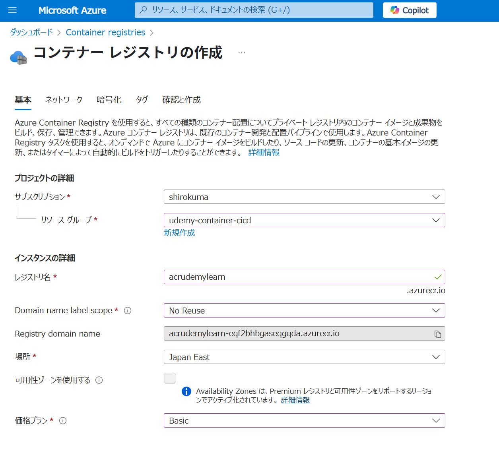
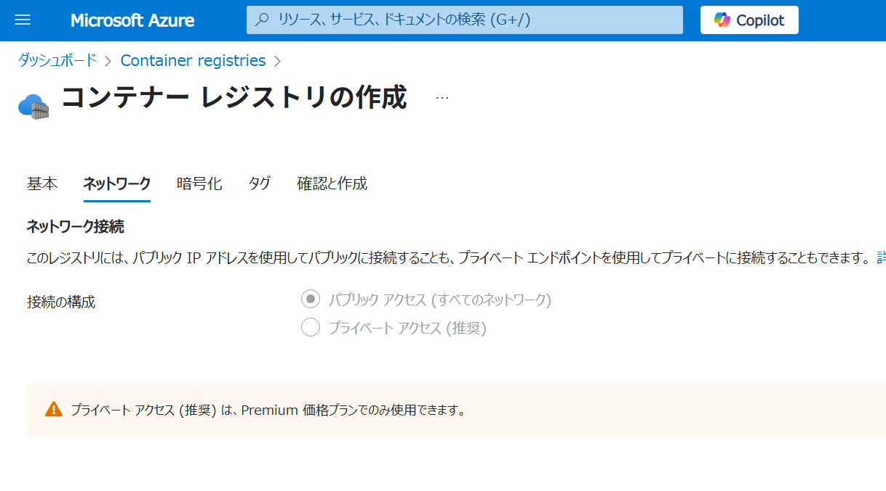
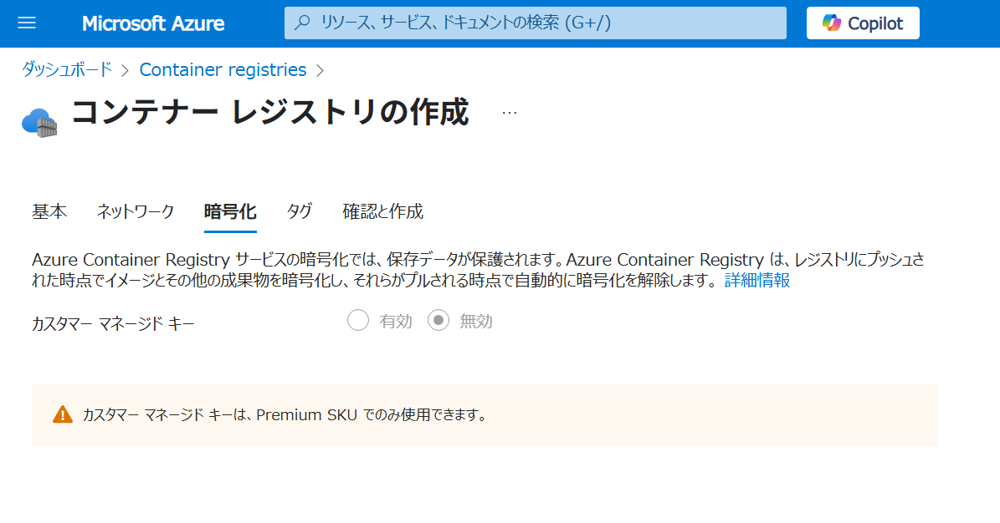
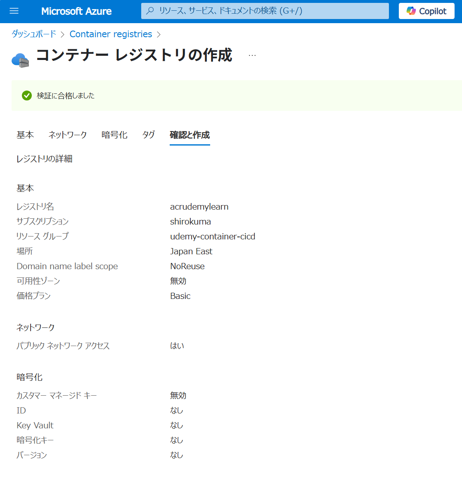
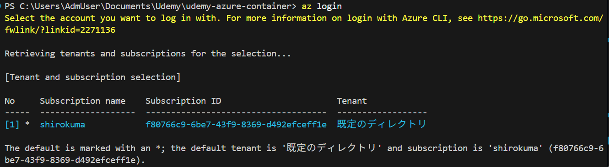
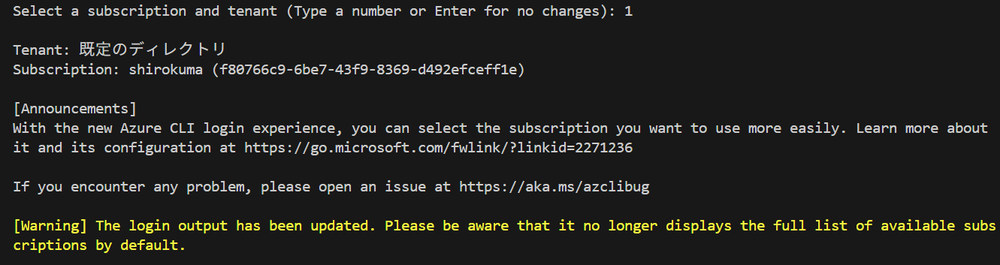
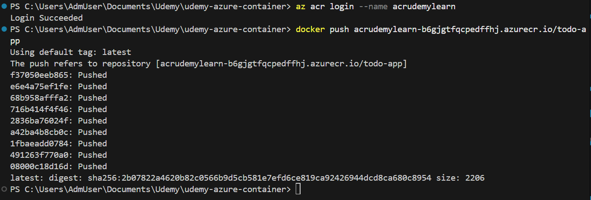

# リソース作成









# (手動)コンテナのPush

```bash
docker-compose build
docker tag todo-app acrudemylearn-b6gjgtfqcpedffhj.azurecr.io/todo-app
```

```bash
az login
az acr login --name acrudemylearn
docker push acrudemylearn-b6gjgtfqcpedffhj.azurecr.io/todo-app
```







## Notify-service Container

```bash
docker tag notify-service acrudemylearn-b6gjgtfqcpedffhj.azurecr.io/notify-service
az acr login --name acrudemylearn
docker push acrudemylearn-b6gjgtfqcpedffhj.azurecr.io/notify-service
```

# Actionsのyamlファイルの作成

Container AppsのマネージドIDが有効かどうかを確認

```yaml