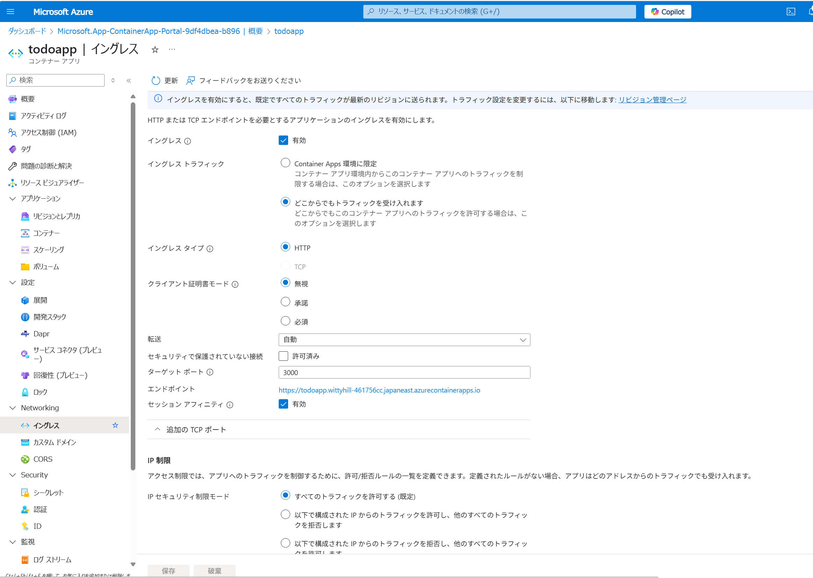

# Container Apps


## ToDoアプリ Container Apps 環境


### ポートバインディング設定
ネットワーク設定で、ポートバインディングを設定します。
443→3000ポートにバインドします。


## notify-service Container Apps 環境

### ACRにPush


CRON式で5分ごとに設定。毎日9時などに設定可能。


## GitHubActionsでのCI/CD
https://learn.microsoft.com/ja-jp/azure/container-apps/github-actions#configuration

Container AppsのマネージドIDを有効にする。サービスプリンシパルIDをメモしておく。33e3aca3-76cc-43ef-a57e-d5bd3f3db199


Azure Container Registry の AcrPull ロールをコンテナー アプリのマネージド ID に割り当てる。


## GitHub リポジトリにシークレットを構成する

コンテナー アプリとコンテナー レジストリを含むリソース グループに対する共同作成者ロールを持つサービス プリンシパルを作成

```bash
az login
az ad sp create-for-rbac --name todoapp-credentials --role contributor --scopes /subscriptions/f80766c9-6be7-43f9-8369-d492efceff1e/resourceGroups/udemy-container-cicd --json-auth --output json
```

出力されるJsonをコピーしておく。

GitHubリポジトリのシークレットに登録する。
Name：AZURE_CREDENTIALS
Secret：Jsonをそのままペースト


### yamlファイルの作成
```yaml
